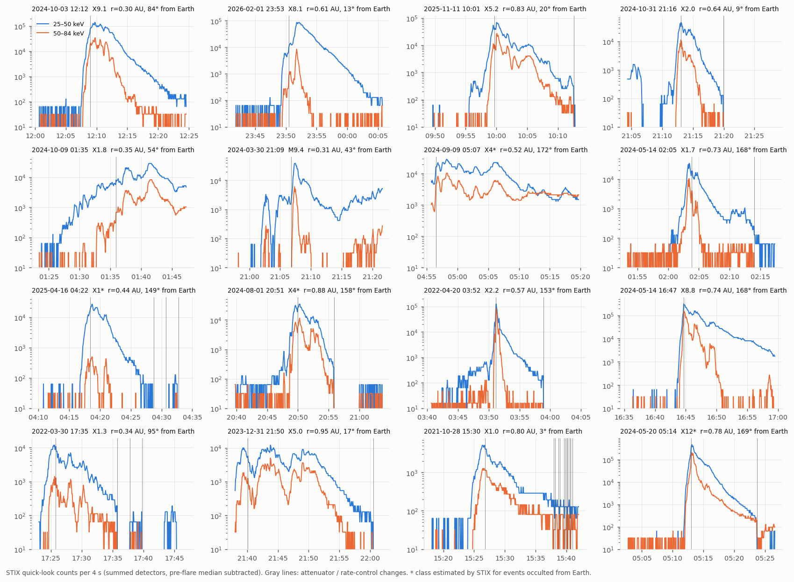

# Does the flaring chromosphere remember? Objectives, hypotheses and methodology (v3)

**Author:** Carlos Alberto Martínez Sibaja
**Status:** research proposal, version 3 (2026-10-03). It replaces v2 (archived in `docs/archive/00_objectives_v2_inference_bias.md`) after the executable tests of `docs/06_usefulness_tests.md` and a new literature and event search. No STIX science data have been analysed yet.

---

## 0. One-page summary

**Working title.** *Target memory, return current or acceleration? Separating the causes of pulse-to-pulse hard X-ray spectral evolution with STIX.*

**Why the question changed.** The tests of `docs/06` showed two things:
- The mechanism behind the v2 question exists. The ionized column left by earlier pulses distorts the spectrum of later ones (the nonuniform-ionization effect of Kontar, Brown & McArthur 2002).
- The v2 question itself ("how much does it bias the standard fit?") has a modest answer, conditional on bright flares and large column growth. As a paper it would be a methods note about a known effect.

The more valuable question is the reverse: **use the time dependence of the spectra to find out which physical process shapes them.** Three processes can change the spectrum from one pulse to the next, and each leaves a different fingerprint in time:

| Process | What changes the spectrum | Fingerprint in time |
|---|---|---|
| **M — target memory** (cumulative ionization and evaporation) | The column of ionized plasma the electrons cross before the neutral chromosphere | The spectral break moves up with the **energy already deposited** at the same footpoints. The hardening is confined to energies near the break, and resets when **new footpoints** light up. Hysteresis: at equal flux, the break is higher late in a pulse or in a later pulse |
| **R — return current** (Alaoui & Holman 2017) | Ohmic energy losses of the beam, set by its **instantaneous flux density** | The break follows the instantaneous flux; no hysteresis; no dependence on deposition history |
| **A — acceleration** (soft-hard-soft, soft-hard-harder) | The injected electron spectrum itself | The index changes **at all energies**, tied to pulse amplitude (soft-hard-soft) or progressively (soft-hard-harder) |

**Research question.**

> In bright flares with several hard X-ray pulses, does the X-ray spectrum depend on the energy previously deposited at the same footpoints (target memory), on the instantaneous beam flux (return current), or on neither (acceleration), and how much of the observed pulse-to-pulse spectral evolution, including progressive hardening, does each explain?

**Why it may be new.** Each process has been studied separately; the time dependence has not been used to discriminate between them.
- Nonuniform-ionization breaks: at the X-ray peak, and in the time evolution of one RHESSI flare (Su, Holman & Dennis 2009, 2011).
- Return-current breaks: at the peak, including a statistical study of 65 RHESSI flares (Alaoui & Holman 2017; Alaoui, Krucker & Saint-Hilaire 2019).
- Soft-hard-soft and soft-hard-harder: interpreted as acceleration and trapping (Grigis & Benz 2004–2008; Kiplinger 1995, who linked soft-hard-harder to solar proton events).
- Time evolution with the warm-target model, using RHESSI and STIX: Bhattacharjee, Kontar & Luo (2025).

The search found no study that uses **history dependence (cumulative versus instantaneous)** and **footpoint novelty from imaging** to discriminate between these processes. This must still be confirmed with ADS (Section 10, K1).

**Data.** STIX science data (spectrograms and pixel data) of bright, multi-pulse flares, selected reproducibly from the STIX data-center catalogue (`scripts/stix_event_search.py`, Figure 7). Primary events: the X5.0 flare of 2023-12-31 and the X5.2 flare of 2025-11-11, both observed from close to the Earth direction (AIA context). The X1.3 flare of 2022-03-30 serves as the benchmark against published pulse-resolved fits. The X9.1 flare of 2024-10-03 is the high-count stress case (Section 5).

**Modelling support** (already built, `docs/06`):
- the two-zone forward model `src/toy_bias.py`, to which a return-current module is to be added;
- HYDRAD runs for the growth of the column with deposited energy;
- the open-source Fokker–Planck solver FP for photons with warm target and return current (`docs/05`);
- RADYN as an optional upgrade, for non-equilibrium hydrogen recombination.

**Product.** One paper (A&A or ApJ) plus a public pipeline: pulse-resolved STIX spectroscopy, history and flux regressors, and injection–recovery with the instrument response.

**Feasibility.** About 20 weeks, with three decision gates. The first decisive signal is due by week 5–6 (Section 9).

---

## 1. Background in brief

- **Nonuniform ionization** (Brown 1973; Kontar, Brown & McArthur 2002; Su et al. 2009, 2011).
  - Electrons lose energy more slowly in neutral than in ionized gas, so the bremsstrahlung yield rises (up to ×2.8) where the target becomes neutral.
  - This flattens the photon spectrum between an upward and a downward knee, whose energy grows with the ionized column, roughly E* ∝ N*^1/2.
  - The index change it can produce is limited to about 0.2–0.7 (Su et al. 2009).
- **Return current** (Holman 2012; Alaoui & Holman 2017; Alaoui et al. 2019). Ohmic losses in the co-spatial return current flatten the spectrum below a break set by the instantaneous beam flux density. RHESSI breaks are typically near 55 keV with Δγ ≈ 0.3–1, often too strong for nonuniform ionization alone.
- **Soft-hard-soft and soft-hard-harder** (Grigis & Benz 2004, 2005, 2008; Kiplinger 1995).
  - The spectral index anti-correlates with flux within peaks, with different rise and decay branches.
  - Progressive hardening across peaks occurs in gradual events and is associated with solar energetic particles.
  - Both are interpreted as acceleration and trapping.
- **Warm target** (Kontar et al. 2015; Bhattacharjee et al. 2025). It constrains the low-energy cut-off; its time evolution shows a high-low-high cut-off around bursts.
- **Coronal thick target** (Veronig & Brown 2004). Dense loops can stop electrons in the corona, giving loop-top hard X-ray sources.
- **This project's own tests** (`docs/06`):
  - For an identical beam, a larger ionized column at the onset of pulse 2 gives a harder fitted δ (by 0.1–0.3) and an apparent drop of the electron rate (up to ×2).
  - HYDRAD with the repository's synthetic beam grows the column only 2.5–4× before pulse 2. A short loop with a 30 s first pulse reaches 65 % of the stopping column.
  - Within each pulse, the beam ionizes the upper chromosphere in seconds (the column of plasma above 3×10⁴ K reaches 6–7×10¹⁹ cm⁻²), so **memory acts on two timescales**:
    - **within a pulse:** ionization;
    - **between pulses:** evaporation, plus recombination, which HYDRAD does not model.

## 2. Research question and sub-questions

**Main question:** stated in Section 0.

| ID | Sub-question | Main observable |
|---|---|---|
| Q1 | Does the spectral break (or curvature) of a time bin depend on the energy previously deposited at the same footpoints, after controlling for the instantaneous flux? | Break energy E_b (or Δγ = γ_low − γ_high) versus cumulative non-thermal energy E_cum and instantaneous flux F |
| Q2 | Is there hysteresis: at matched flux, does the break differ between the rise and the decay of a pulse, and between an early and a late pulse? | ΔE_b at matched F |
| Q3 | Is the pulse-to-pulse hardening confined to the energies near the break (memory, return current), or present at all energies (acceleration)? | Δγ in a low band (≈ 20–40 keV) versus a high band (≈ 50–100 keV) |
| Q4 | Does the spectral memory reset when the emission moves to new footpoints? | Footpoint displacement between pulses from STIX imaging, as a covariate |
| Q5 | Does the coronal (loop-top) fraction of the non-thermal emission grow with E_cum? | Imaging spectroscopy of loop-top versus footpoints |
| Q6 | What timescale does the memory have between pulses? | Dependence of the residual effect on the waiting time between pulses |

## 3. Hypotheses and predicted signatures

| ID | Hypothesis | Prediction (pre-registered form) | Refuted if |
|---|---|---|---|
| **H0** | No history dependence: the spectral shape depends only on the instantaneous beam and its acceleration. | Coefficient of log E_cum in the regression of E_b (or Δγ) is zero | — |
| **H_M** | Target memory: the break tracks the cumulative energy deposited at the same footpoints. | β_cum > 0 at ≥ 3σ; Δγ confined to the band around E_b; resets with new footpoints; positive hysteresis | β_cum compatible with 0, or the same hardening appears in the high band, or no reset with new footpoints |
| **H_R** | Return current: the break tracks the instantaneous flux density. | β_F > 0 at ≥ 3σ, β_cum ≈ 0, no hysteresis | β_F compatible with 0, or hysteresis present |
| **H_A** | Acceleration: index changes at all energies, tied to amplitude or time. | Δγ_low ≈ Δγ_high; soft-hard-soft relation with flux; no footpoint-reset dependence | Δγ_high ≪ Δγ_low |

The hypotheses are not exclusive; the regression estimates the share of each. **A null result for H_M is a result:** an upper limit on spectral memory in bright flares, which tells analysts that pulse-by-pulse fits can ignore it. Thresholds marked *proposed* are fixed in the pre-registration (Section 6.7).

## 4. Objectives

### O1 — Event selection and data (weeks 1–3)
- **Method:** reproducible catalogue search (`scripts/stix_event_search.py`), visual check of the quick-look light curves (Figure 7), quick-look imaging previews, and observing geometry (distance, angle to Earth).
- **Success:** two primary events plus a benchmark, each with ≥ 4 resolvable non-thermal pulses and ≳ 10⁵ counts per pulse in 25–84 keV. Science data (spectrogram and pixel data) are available for them, with attenuator and rate-control states documented.

### O2 — Pulse-resolved spectroscopy (weeks 3–10)
- **Models per time bin:**
  1. isothermal + cold thick target, the standard model;
  2. isothermal + broken power law, giving E_b and Δγ;
  3. isothermal + two-zone (nonuniform ionization), giving N*;
  4. as a cross-check, warm target and return current where available.
- **Instrument handling:** full instrument response, background, attenuator, and live time / pile-up handling (OSPEX or sunkit-spex; to be decided with the supervisor).
- **Bins:** time bins adapted to counts. One per pulse phase (rise, peak, decay) where statistics allow; pulse-integrated otherwise.
- **Success:** parameters with uncertainties for every bin; a goodness of fit recorded for every model; failed fits reported.

### O3 — History and geometry regressors (weeks 6–11)
- **Cumulative energy E_cum,** computed in two ways (both reported):
  - model-independent: cumulative background-subtracted counts above 25 keV;
  - model-based: cumulative thick-target power with a fixed reference cut-off. A cut-off fitted pulse by pulse would itself be biased by memory.
- **Instantaneous flux density F:** power divided by the footpoint area from imaging.
- **Footpoint displacement:** STIX imaging per pulse (CLEAN or MEM_GE), as a continuous covariate, with ribbon context from AIA when the event is visible from Earth.
- **Success:** each bin has E_cum, F and footpoint displacement with uncertainties.

### O4 — The discriminating test (weeks 10–14)
- **Method:** mixed regression with a random effect per flare,
  E_b (or Δγ) = β₀ + β_cum log E_cum + β_F log F + β_amp log(amplitude) + β_disp · displacement + ε.
  Added to it: hysteresis at matched flux (Q2) and the two-band test (Q3).
- **Success:** each β estimated with its uncertainty; the decision rules of Section 6.7 applied; the share of each process given per flare.

### O5 — Forward modelling and injection–recovery (weeks 4–14, in parallel)
- **Toy model:** add a return-current module to `src/toy_bias.py` (energy loss in the return-current region, Alaoui & Holman 2017) and the real STIX response.
- **Calibration of the memory expectation:** with HYDRAD (and FP or RADYN if available), the expected change in E_b per unit E_cum for the event's energetics.
- **Injection–recovery:** simulate each process separately and check that the regression of O4 recovers the right β with the event's counts and time bins. This is the **power test**, gate G2.
- **Success:** the recovery matrix (true process → inferred β) with false-positive and false-negative rates.

### O6 — Paper and pipeline (weeks 15–20)
- Proof-of-concept paper with two to four flares, the regression results and an interpretation backed by the forward models.
- Pipeline published with the paper.

## 5. Data and event selection (status 2026-10-03)

Procedure (`scripts/stix_event_search.py`):
1. STIX flare list sorted by the 50–84 keV quick-look band.
2. Particle-background entries rejected (a flare has more net counts at 15–25 keV than at 50–84 keV).
3. Net 25–50 keV peak ≥ 2×10⁴ counts per 4 s.
4. Quick-look curves of the best candidates and of three events known for their pulses inspected by eye (Figure 7). The automatic pulse counter is not reliable in large events, because of background-window choice and attenuator steps, so it is used only for ranking.

| Event | GOES / STIX class | SolO r [AU] | Angle to Earth | Peak net counts per 4 s, 25–50 / 50–84 keV | Net 25–84 keV counts in ±12 min | Non-thermal pulses (by eye) | Role |
|---|---|---|---|---|---|---|---|
| 2023-12-31 21:50 | X5.0 / X5 | 0.95 | 18° | 1.2×10⁴ / 5.0×10³ | 1.6×10⁶ | ≥ 6 over ~14 min | **Primary.** Earth view; also observed by ASO-S/HXI (triangulation paper exists) |
| 2025-11-11 10:01 | X5.2 / X4 | 0.83 | 20° | 6.9×10⁴ / 2.7×10⁴ | 3.0×10⁶ | 4–5 over ~8 min | **Primary.** Earth view |
| 2022-03-30 17:2x | X1.3 / — | 0.34 | 96° | 1.2×10⁴ / 1.4×10³ | 5.7×10⁵ | ~8–10 (quasi-periodic) | **Benchmark.** Pulse-resolved fits published (Collier et al. 2024); counts per pulse marginal |
| 2024-10-03 12:12 | X9.1 / X3 | 0.30 | 85° | 1.4×10⁵ / 3.5×10⁴ | 7.3×10⁶ | 5–6 over ~6 min | **Stress case.** Highest counts; pile-up risk at 0.30 AU; the same flare is studied by another group (Litwicka et al., with a different question) |
| 2024-05-14 16:47 | X8.8 / X8 | 0.74 | 168° | 3.1×10⁵ / 1.6×10⁵ | 1.2×10⁷ | 1 dominant + several smaller | Reserve; heavily studied |
| 2024-10-09 01:35 | X1.8 / M3 | 0.35 | 54° | 2.9×10⁴ / 8.4×10³ | 2.8×10⁶ | 3–5 over ~10 min | Reserve; STIX class well below GOES (partial occultation to be checked) |
| 2024-08-01 20:51 | — / X4 | 0.88 | 158° | 3.4×10⁴ / 1.1×10⁴ | 1.4×10⁶ | 3–5 | Reserve; far side for Earth |
| 2021-10-28 15:30 | X1.0 / — | 0.80 | 4° | 5.1×10³ / 1.3×10³ | 3.0×10⁵ | main pulse + bumps; 12 rate-control changes | Soft-hard-harder angle: associated with the GLE73 proton event; counts marginal |

Quick-look counts are compressed and summed over detectors. They rank events but are not spectroscopic data. "Pulses by eye" must be confirmed with the science data.

*Figure 7.* STIX quick-look 25–50 keV (blue) and 50–84 keV (orange) light curves of the candidates (`scripts/plot_stix_candidates.py`). Gray lines mark attenuator and rate-control changes; an asterisk marks a class estimated by STIX for events occulted from Earth.

## 6. Methodology

### 6.1 Pulses and time bins
Pulses are defined in the 25–84 keV science light curve. Overlapping pulses are not forced apart; the analysis works on time bins, with the pulse phase (rise, peak, decay) as a label. Bins are adaptive, with a minimum number of counts above 25 keV fixed in the pre-registration (*proposed:* 3×10⁴).

### 6.2 Spectral models
1. Standard: isothermal (or two thermal components when a superhot plasma is present, cf. the 2026 STIX superhot study) + cold thick target.
2. Broken power law: E_b, γ_low, γ_high.
3. Two-zone (nonuniform ionization): N*, δ, Ec, Ṅ.
4. Cross-checks: warm target, and return current if an implementation is available. Otherwise the toy return-current module is used as the fitting model.

Albedo is included or excluded consistently for all bins of a flare. Its effect is nearly constant for fixed footpoints and varies with heliocentric angle.

### 6.3 Systematics that can imitate the signal
| Systematic | Why it matters | Handling |
|---|---|---|
| Pile-up and live time at high rates | Produces flux-correlated spurious hardening, which imitates return current or acceleration | Prefer events at larger distance and rates within the documented limits; compare attenuator and rate-control states; include pile-up in the injection–recovery |
| Attenuator insertion | Changes the low-energy response abruptly | Fit only within constant states, or with the state-dependent response; exclude bins at transitions |
| Thermal (superhot) emission | Raises the lower limit of the non-thermal fit to 25–30 keV; hides breaks below it | Two-temperature models; report the usable lower energy per bin; the memory test needs E_b ≳ 30 keV |
| Background at high energies | Biases γ_high | Background from the dedicated detector; stop the fit where the source drops below a fixed signal-to-noise ratio |
| Memory bias in Ṅ and Ec | Makes model-based E_cum circular | Use the count-based E_cum as the primary regressor |

### 6.4 History and geometry regressors
Section O3. E_cum is reset for an emitting region when its footpoint moves by more than a source size (*proposed:* one FWHM of the STIX point-spread function at the event distance).

### 6.5 Imaging
Per pulse, in 20–30 and 30–60 keV:
- footpoint centroids and separation;
- loop-top fraction, where the dynamic range allows;
- ribbon context from AIA 1600/1700 Å for events visible from Earth.

### 6.6 Forward modelling
- **Toy model:** two-zone target plus return-current module, with the STIX response, used for the injection–recovery (O5).
- **Expected size of the memory effect:** HYDRAD gives the growth of the column with deposited energy. Its present limit is NaN for F ≥ 2.5×10¹⁰ erg cm⁻² s⁻¹ (`docs/06`, Section 7).
- **FP:** photons with warm target and return current, run on HYDRAD snapshots (`docs/05`).
- **RADYN (optional):** recombination timescale of hydrogen after a pulse, which sets the between-pulse memory (Q6).

### 6.7 Decision rules (to be pre-registered before the regression is run on real data)
- **Memory detected:** β_cum > 0 at ≥ 3σ (*proposed*) for the count-based E_cum, robust to the model-based E_cum. It must also show either confinement (|Δγ_high| < |Δγ_low| / 2, *proposed*) or a footpoint reset.
- **Return current favoured:** β_F > 0 at ≥ 3σ with β_cum compatible with 0 and no hysteresis.
- **Acceleration favoured:** Δγ_low and Δγ_high equal within errors and β_cum, β_F compatible with 0.
- **Multiple comparisons:** the number of tested coefficients is fixed in advance; Holm correction.
- **All fits reported,** including failed and degenerate ones.

## 7. Possible outcomes and what each means

| Outcome | Meaning | Contribution |
|---|---|---|
| Memory detected | Later pulses see a target modified by earlier ones; part of the pulse-to-pulse hardening is a transport effect | A new diagnostic of evaporation and ionization from hard X-rays alone; a caveat for acceleration studies and for soft-hard-harder interpretations |
| Return current favoured | Breaks are set by the instantaneous beam | An independent, time-domain test supporting return-current models |
| Acceleration favoured | Spectral evolution reflects the injected electrons | Supports current acceleration interpretations; an upper limit on target effects |
| Not decidable at STIX statistics | Degenerate within errors | The injection–recovery power curve tells what counts and cadence a future instrument needs |

## 8. Deliverables

| ID | Deliverable | Status |
|---|---|---|
| D1 | Event selection: procedure, catalogue query, candidate table, light curves | **Done (quick-look level)** (`scripts/stix_event_search.py`, Figure 7) |
| D2 | Science-data reduction for the selected events | Pending |
| D3 | Pulse-resolved fits with four models | Pending |
| D4 | Regressors E_cum, F, displacement; imaging per pulse | Pending |
| D5 | Regression and hysteresis tests | Pending |
| D6 | Toy model with return-current module and real response; injection–recovery | Toy model **done without return current**; rest pending |
| D7 | Calibration of the expected memory effect (HYDRAD/FP/RADYN) | **Partial** (`docs/06`) |
| D8 | Paper and public pipeline | Pending |

Existing infrastructure kept from v1 and v2:
- beam tables, the E1–E5 matrix and the RADYN `ftab` encoder;
- the FP atmosphere reader and writer;
- HYDRAD scripts and the toy model.

All of it serves O5.

## 9. Timeline (20 weeks) and gates

| Weeks | Work | Gate |
|---|---|---|
| 1–2 | ADS novelty search (K1); obtain science data for the primary events; set up the spectroscopy and imaging tools with the supervisor's group | **G1:** no prior paper doing the history test; data in hand |
| 3–5 | Reduce the first primary event; first pulse-integrated fits; injection–recovery with the real response at the event's counts | **G2 (power test):** the predicted memory effect is ≥ 3σ detectable for at least one primary event |
| 6–10 | Time-resolved fits (four models), imaging, regressors for both primaries; benchmark against the published 2022-03-30 fits | **G3:** systematics (pile-up, attenuator) controlled |
| 10–14 | Regression, hysteresis and two-band tests; forward-model interpretation | — |
| 15–20 | Paper draft, pipeline cleanup, supervisor review | — |

## 10. Risks and kill criteria

| Risk | Effect | Mitigation |
|---|---|---|
| K1 — prior work found in ADS (history-dependence test of breaks) | Loss of novelty | Pivot to the soft-hard-harder angle (Q3 across many flares), or to the memory timescale (Q6) |
| K2 — the power test fails (G2) | The test cannot decide at STIX statistics | Stop the core; publish the power curve and event analysis as a short paper, or return to a modelling paper on the bias (v2) |
| K3 — pile-up or attenuator systematics comparable to the effect | False signals | Restrict to lower-rate events and bins; event at 0.83–0.95 AU first |
| Too few independent pulses (E_cum and F correlated in time) | Coefficients not separable | Use within-pulse hysteresis and several flares; pool with random effects |
| Tools: the nonuniform-ionization and return-current models may not exist in the chosen fitting package | Delay | Use the toy forward model as fitting function with the real response |
| Competition (STIX team, Glasgow and Wrocław groups) | Priority | Early discussion with the supervisor; focus on the discriminating design |

## 11. Scope limits
- A proof of concept on two to four flares; no population statistics in this paper.
- Hard X-ray spectroscopy and imaging are the core; chromospheric line diagnostics are context only.
- Simulations support the interpretation; they are not the result.
- No detection, novelty or journal is promised.

## 12. Open questions for the supervisor
1. Is the discriminating design (history versus instantaneous flux versus acceleration) of interest for the group, and does it overlap with ongoing work in the STIX team?
2. Which spectroscopy tools does the group use for STIX (OSPEX or sunkit-spex; pile-up and live-time corrections; nonuniform-ionization and return-current models)?
3. Are the 2023-12-31 and 2025-11-11 flares suitable, or does the group know better multi-pulse events?
4. Which imaging algorithm and dynamic range are realistic for loop-top versus footpoint separation in these events?
5. Is RADYN access worth pursuing for the recombination timescale, or should the modelling stay with HYDRAD, FP and the toy model?

## 13. References (selection; to be completed and checked before citing)
- Alaoui, M. & Holman, G. D. (2017), co-spatial return-current model of hard X-ray breaks (arXiv:1706.03897).
- Alaoui, M., Krucker, S. & Saint-Hilaire, P. (2019), Statistical study of hard X-ray spectral breaks, Solar Physics 294, 105.
- Allred, J. C. et al. (2020), FP: Fokker–Planck transport, ApJ 902, 16.
- Bhattacharjee, Kontar & Luo (2025), warm-target time evolution with RHESSI and STIX, ApJ (arXiv:2506.08310).
- Collier, H. et al. (2024), Localising pulsations in the hard X-ray and microwave emission of an X-class flare, A&A (arXiv:2402.10546).
- Grigis, P. C. & Benz, A. O. (2004, 2005, 2008), soft-hard-soft and spectral hardening of large flares.
- Kiplinger, A. L. (1995), soft-hard-harder and solar proton events, ApJ 453, 973.
- Kontar, E. P., Brown, J. C. & McArthur, G. K. (2002), nonuniform target ionization, Solar Physics 210, 419.
- Krucker, S. et al. (2020), STIX, A&A 642, A15.
- Su, Y., Holman, G. D., Dennis, B. R. et al. (2009, 2011), ApJ 705, 1584; ApJ 731, 106.
- Veronig, A. M. & Brown, J. C. (2004), coronal thick-target hard X-ray sources, ApJ 603, L117.
- Prior-work reviews of v1 and v2: `docs/03_novelty_and_prior_work.md`.

## 14. History of the question
- **v1 (2026-10-02):** how does the atmosphere respond to the second and third pulse? Dropped: the qualitative answer is known (Kennedy et al. 2015).
- **v2 (2026-10-02):** how much does atmospheric memory bias the standard STIX fit? Tested on 2026-10-03 (`docs/06`). The effect is real, but conditional and known in mechanism; as a stand-alone paper it would be a methods note. It is kept as the forward-modelling component of v3.
- **v3 (2026-10-03, this document):** use the time dependence of the spectra to discriminate target memory, return current and acceleration.
