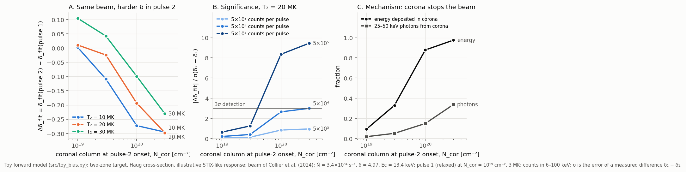

# Executable tests of the project's usefulness

**Author:** Carlos Alberto Martínez Sibaja
**Date:** 2026-10-03
**Code:** `src/toy_bias.py` (forward model and fits, 8 unit tests in `tests/test_toy_bias.py`), `scripts/toy_bias_sweep.py`, `scripts/plot_toy_bias.py`, `scripts/hydrad_column_test.py`, `scripts/hydrad_gate_variants.py`. Numerical outputs go to `results/` (git-ignored); every number below can be regenerated with those scripts.

## 0. Bottom line

1. **The mechanism exists and has a definite sign.** When the first pulse raises the ionized column that the second pulse must cross, the standard fit (isothermal + cold, fully ionized thick target) returns a **harder δ** (by 0.1–0.3) and a **lower electron rate** (by up to a factor of ~2) for an identical injected beam. In this toy it is the known nonuniform-ionization effect of Kontar, Brown & McArthur (2002) acting from pulse to pulse, not thermal contamination, which pushes δ the other way.
2. **It matters only if two conditions hold together.** First, the ionized column at the onset of pulse 2 must reach about 5×10¹⁹–10²⁰ cm⁻², comparable to the stopping column of the electrons near Ec. Second, the pulses must be bright: about 10⁵ counts or more per pulse in 6–100 keV with the illustrative response used here. For a beam like the first burst of Collier et al. (2024) with comparable statistics (σ_δ ≈ 0.1), the bias stays below 2σ.
3. **HYDRAD says the first condition is not automatic.** With the synthetic beam of the repository (F = 1.3×10¹⁰ erg cm⁻² s⁻¹, 10 s pulses, 20 s gap), the column at pulse-2 onset grows only 2.5–4× (to 7–9×10¹⁸ cm⁻², 9–11 % of the stopping column) in 60 Mm and 26 Mm loops, and the predicted bias is negligible (Δδ = −0.04). A short loop (26 Mm) with a 30 s first pulse reaches 5×10¹⁹ cm⁻² (65 %) and gives Δδ = −0.27, 3σ at 10⁵ counts.
4. **HYDRAD cannot explore the interesting part of the parameter space as configured.** All runs with F ≥ 2.5×10¹⁰ erg cm⁻² s⁻¹, and a 30 s pulse in the 60 Mm loop, end in NaN during the pulse.
5. **An existing tool already absorbs the effect in the toy.** Fitting the two-zone (nonuniform-ionization) model removes the bias, and for bright pulses it measures the column change between pulses (Δlog N_cor = 1 at ≈3σ with ~4×10⁵ counts). In the toy this result is circular (the data are generated with that model), but it shows that the useful product may be a pulse-by-pulse measurement of the evaporated column rather than a correction.

**Consequence for the project:** the idea is physically sound but its value depends on flare selection (bright, short loops, energetic first pulse) and on having a hydrodynamic code that survives realistic fluxes. The next decisive steps are listed in Section 8.

## 1. What was tested and why

The critics panel asked for the cheapest experiment that could decide whether the memory-induced bias is material: a forward model with the coronal column and temperature as parameters, analytic photons, a STIX-like response and the same fit, asking for which columns, temperatures and count levels |ΔB| exceeds 3σ. That is the toy model. The HYDRAD column test (the gate OE1 of `docs/00`) then supplies realistic columns for the toy.

ΔB is defined as fit(pulse 2) − fit(pulse 1) for the **same injected beam**, so it isolates the effect of the atmosphere. Its significance is |ΔB| / sqrt(σ₁² + σ₂²), the error of a measured difference between two pulses.

## 2. The toy model

Details are in the docstring of `src/toy_bias.py`. In short:

- **Target:** beamed electrons (μ = 1) slow down by Coulomb collisions (dE/dN = −K/E). The target has two zones: a fully ionized corona of column N_cor, then a neutral chromosphere. K_ion/K_neut = 2.8 (Kontar et al. 2002); Λ_ion = 20.
- **Photons:** Haug (1997) electron–ion cross-section with the Elwert factor, z = 1.2. The thermal emission uses the same cross-section averaged over a Maxwellian. There are no lines or free–bound emission, in either the generated data or the fit.
- **Instrument:** an illustrative STIX-like response, not the STIX response matrix. It has a 6 cm² area with low- and high-energy cut-offs, Gaussian resolution, and STIX-like science channels (to be checked). The exposure is 10 s at 0.5 AU, and the fit range is 6–100 keV with Poisson (Cash) statistics.
- **Fits:** the standard model has 5 parameters (T, EM, Ṅ, δ, Ec); the two-zone model adds N_cor.
  - Biases come from fitting the noise-free expected counts (Asimov fit).
  - Errors come from the Poisson Fisher matrix, checked against Monte Carlo (Section 6).
- **Not included:** warm target, return current, pitch-angle scattering, albedo, lines, pile-up, attenuator, background and hydrodynamics.

**Verification of the code:** 8 unit tests in `tests/test_toy_bias.py`.

| Test | What it checks |
|---|---|
| Haug cross-section | Equals the non-relativistic Bethe–Heitler × Elwert limit within 5 % at 10 keV; vanishes above the tip |
| Thick target with a Kramers cross-section | Photon index = δ − 1 within 0.01 (tests transport, injection and integration) |
| Thermal spectrum with the Born cross-section | Equals Rybicki & Lightman (Eq. 5.14a) with the Born Gaunt factor, up to the relativistic speed correction (≤ 6 % at 40 keV) |
| Injection weights | Conserve electron number (5×10⁻⁴) and power (10⁻³); continuous in Ec |
| Two-zone limits | N_cor = 0 and N_cor = ∞; the neutral/ionized yield ratio is 2.8 |
| Coronal energy fraction | Correct limits; monotone in N_cor |
| Instrument | Redistribution conserves photons |
| Negative control | The fit recovers the injected parameters when the target matches the model (standard and two-zone) |

The cross-section was also compared with FP's `Brm_BremCross` over 1805 (E, k) pairs: the maximum relative difference is 9×10⁻⁵, which comes from rounding of the constants.

## 3. Sweep: bias versus coronal column, temperature and brightness

Beam of the first burst of Collier et al. (2024): Ṅ = 3.4×10³⁴ s⁻¹, δ = 4.97, Ec = 13.4 keV. Pulse 1 is relaxed: N_cor = 10¹⁹ cm⁻², T = 3 MK. Pulse 2 takes the listed N_cor and T₂, with EM tied to N_cor through the loop geometry (area 10¹⁷ cm², half-length 13 Mm).

Counts in 6–100 keV for pulse 1: 3.8×10³, 3.8×10⁴ and 3.8×10⁵ at brightness 0.1, 1 and 10, with σ_δ = 0.115, 0.036 and 0.011. The σ_δ = 0.09 reported by Collier et al. corresponds to about 6×10³ counts in this toy.

The asymptotic bias does not depend on brightness, so it is listed once. The z columns give its significance at the three count levels.

| N_cor (pulse 2) [cm⁻²] | T₂ [MK] | Δδ | z at 3.8×10³ | z at 3.8×10⁴ | z at 3.8×10⁵ | Ṅ₂/Ṅ₁ (fit) | coronal energy fraction |
|---|---|---|---|---|---|---|---|
| 1×10¹⁹ (control) | 10 / 20 / 30 | +0.00 / +0.01 / +0.10 | 0.0 / 0.1 / 0.4 | 0.0 / 0.2 / 1.2 | 0.1 / 0.6 / 3.8 | 0.96 / 1.17 / 1.35 | 0.09 |
| 3×10¹⁹ | 10 / 20 / 30 | −0.11 / −0.02 / +0.04 | −0.7 / −0.1 / 0.1 | −2.1 / −0.4 / 0.4 | −6.6 / −1.2 / 1.3 | 0.56 / 2.00 / 1.04 | 0.33 |
| 1×10²⁰ | 10 / 20 / 30 | −0.27 / −0.19 / −0.10 | −1.6 / −0.8 / −0.2 | −5.1 / −2.6 / −0.8 | −16.1 / −8.4 / −2.4 | 0.41 / 1.22 / 0.89 | 0.88 |
| 3×10²⁰ | 10 / 20 / 30 | −0.30 / −0.30 / −0.23 | −1.7 / −0.9 / −0.4 | −5.5 / −3.0 / −1.2 | −17.3 / −9.5 / −3.7 | 0.46 / 0.51 / 0.60 | 0.98 |

- **Baseline bias of pulse 1 (B₁):** δ −0.13, Ec −0.3 keV, Ṅ overestimated ×2.45. This is the known overestimate of the fully ionized assumption, close to the factor of 2.8 in Kontar et al. (2002).
- **Ec and Ṅ are poorly constrained when a hot, dense plasma is present.** For T₂ ≥ 20 MK and N_cor ≥ 10²⁰ cm⁻², the Fisher error of the Ec difference is 3–27 keV at 3.8×10⁴ counts, and up to 86 keV at 3.8×10³. The Ṅ ratios in those rows are therefore not significant; only δ carries a robust signal there.

*Figure 6.*
- **A.** Shift of the fitted δ for an identical beam, versus the column at pulse-2 onset.
- **B.** Its significance at three count levels (T₂ = 20 MK).
- **C.** Fraction of the beam energy, and of the 25–50 keV photons, coming from the corona. The coronal photon fraction (2–34 %) is an upper bound on a loop-top source, because coronal emission is spread along the legs.

## 4. Which mechanism produces it (N_cor 10²⁰ cm⁻², T₂ 20 MK, 3.8×10⁴ counts)

| Case | Δδ (z) | ΔEc [keV] (z) | Ṅ₂/Ṅ₁ (z) |
|---|---|---|---|
| Column only (thermal as in pulse 1) | −0.28 (−5.3) | +0.76 (0.5) | 0.43 (−2.0) |
| Thermal only (column as in pulse 1) | +0.08 (1.1) | −1.56 (−0.9) | 1.82 (0.9) |
| Both | −0.19 (−2.6) | −2.33 (−0.7) | 1.22 (0.2) |

The δ bias comes from the ionized column. The thermal component works against it and is partly absorbed by the isothermal term of the fit.

## 5. Does the existing nonuniform-ionization fit remove it?

Fitting the two-zone model to the same data returns ΔB = 0 for δ, Ec and Ṅ. This is **circular**, because the data were generated with that model; real atmospheres are not a step in ionization. The informative output is how well N_cor is constrained:

| Counts per pulse | log₁₀ N_cor, pulse 1 (true 19.0) | log₁₀ N_cor, pulse 2 (true 20.0) | log₁₀ N_cor, pulse 2 (true 20.48) |
|---|---|---|---|
| 3.8×10⁴ | 19.00 ± 0.22 | 20.00 ± 0.99 | 20.48 ± 0.70 |
| 3.8×10⁵ | 19.00 ± 0.07 | 20.00 ± 0.31 | 20.48 ± 0.22 |

At ~4×10⁵ counts per pulse, the growth of the column from 10¹⁹ to 10²⁰ is measured at ≈3σ. Su, Holman & Dennis (2011) followed the time evolution of nonuniform-ionization breaks in one RHESSI flare, so this use is related to existing work. That is the main check for novelty if the project moves in this direction.

**Sensitivity.** With K_ion/K_neut = 3.4 instead of 2.8, Δδ = −0.23 (z −3.5). With a fit range of 10–100 keV instead of 6–100 keV, Δδ = −0.20 (z −2.4). Both are at N_cor = 10²⁰, 20 MK, 3.8×10⁴ counts.

## 6. Monte Carlo check of the shortcut

The point is N_cor = 10²⁰ cm⁻², 20 MK, 3.8×10⁴ counts, with 200 Poisson realizations per pulse fitted with the full procedure.

| Parameter | Monte Carlo ΔB ± σ_diff | Asimov ΔB ± Fisher σ_diff |
|---|---|---|
| δ | −0.178 ± 0.080 | −0.194 ± 0.073 |
| Ec [keV] | −0.40 ± 3.10 | −2.33 ± 3.29 |
| log₁₀ Ṅ | −0.12 ± 0.38 | +0.09 ± 0.50 |

The shortcut reproduces δ. For Ec and Ṅ both methods agree that the shift is not significant.

## 7. HYDRAD column test (gate OE1) and the bias it implies

HYDRAD (vendor copy, built with `-DBEAM_HEATING`, run in a scratch copy) was run with pulse 1 only, up to the last profile before the pulse-2 ramp. The column is that of the plasma hotter than 3×10⁴ K, taken as the ionized boundary. HYDRAD's output has n_e = n_H, so ionization is not modelled. The toy uses the same synthetic beam (Ec = 20 keV, δ = 5, area 10¹⁷ cm²); the stopping column at 20 keV is 7.7×10¹⁹ cm⁻².

| Variant | Loop | F [erg cm⁻² s⁻¹] | Pulse 1 | N_cor relaxed → pulse-2 onset [cm⁻²] | / N_stop | Δδ (z at 10⁵ / 10⁶ counts) | Ṅ₂/Ṅ₁ |
|---|---|---|---|---|---|---|---|
| V0 (repository base case) | 60 Mm | 1.3×10¹⁰ | 10 s | 3.4×10¹⁸ → 8.6×10¹⁸ | 0.11 | −0.04 (−0.7 / −2.3) | 0.99 |
| V1 | 26 Mm | 1.3×10¹⁰ | 10 s | 1.7×10¹⁸ → 6.8×10¹⁸ | 0.09 | −0.04 (−0.7 / −2.3) | 0.99 |
| V5 | 26 Mm | 1.3×10¹⁰ | 30 s | 1.7×10¹⁸ → 5.0×10¹⁹ | 0.65 | −0.27 (−3.1 / −10.0) | 0.62 |
| V2 | 60 Mm | 1.3×10¹⁰ | 30 s | NaN at t ≈ 21–25 s (also with a 2 s ramp) | — | — | — |
| V3, V4, V6 | 60 / 26 Mm | 2.5–5×10¹⁰ | 10 s | NaN at t ≈ 6–7 s (also with 1–3 s ramps) | — | — | — |

The E2 and E5 runs are identical up to the pulse-2 ramp (difference 0), as the shared history requires.

**Within-pulse ionization.** During each pulse, the column hotter than 3×10⁴ K jumps to 6–7×10¹⁹ cm⁻² within a few seconds, because the beam heats the upper chromosphere. It falls back to ~10¹⁹ within ~5 s after the pulse ends. With HYDRAD's temperature proxy, most of the ionization memory is therefore lost between pulses. Real hydrogen recombination is out of equilibrium and may be slower; HYDRAD does not model it and RADYN does. This is the place where the RADYN upgrade could change the conclusion.

**The NaN failure** appears in almost all cells at once, during the pulse. It happens when T_max reaches 5–12 MK and |v| reaches 140–250 km/s near the transition region (s ≈ 5–8×10⁸ cm). It is not caused by the beam table. Next diagnostic steps:
- the time step at failure;
- the energy balance of the first cell that fails;
- HYDRAD's optically thick or NLTE chromosphere options, which are not enabled in the shipped configuration.

## 8. What this means, and the next decisive tests

- **The usefulness is conditional, not refuted.** The bias is large enough to matter (Δδ ≈ −0.2 to −0.3, apparent Ṅ drop up to ×2) only for energetic first pulses in short loops, observed with ~10⁵ counts per pulse or more.
- **Making the code survive realistic fluxes is now the bottleneck,** more than the physics. The options are fixing HYDRAD, using RADYN+FP, or accepting the toy for the parameter map.
- **The physics is the known nonuniform-ionization effect.** The contribution would be its pulse-to-pulse consequence and the STIX detectability, or turning it into a measurement of the evaporated column. The novelty search must include Su et al. (2009, 2011) and Kontar et al. (2002, 2003).

Next tests, cheapest first:
1. **Real data, without simulation.** Pick a bright STIX flare with ≥ 2 pulses (≥ 10⁵ counts per pulse in 6–100 keV) and fit each pulse with the standard model and with the nonuniform-ionization model (OSPEX or sunkit-spex). If the fitted ionized column grows between pulses and the two-zone fit improves pulse 2 significantly, the effect is observed. If not, the project's premise weakens.
2. **The HYDRAD NaN** (Section 7), or RADYN, to cover F ≥ 2.5×10¹⁰ and long pulses. Then repeat the gate variants.
3. **FP on the HYDRAD snapshots** (`docs/05`), to replace the step-ionization photons with Fokker–Planck photons including the warm target and the return current.
4. **Hydrogen recombination time** in the upper chromosphere after pulse 1. Ionization memory is the quantity that HYDRAD cannot provide.
